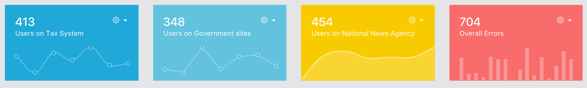

# MicroEvent

## A set of distributed challenges

* [Introduction](#introduction)
* [High Level Overview](#high-level-overview)
* [Prerequisites](#prerequisites)
* [Getting Started](#getting-started)
* [Challenges](#challenges)
* [Tools and Libraries](#tools-and-libraries)

## Introduction

We live in a highly connected world.
More and more critical services are available through the internet and become essential parts of our life.
Many countries have now ratified the decision to create a shared group of highly skilled professional with the only goal of monitoring and keep these crucial systems online.

Congratulations, you have been selected among thousands to help us in this endeavour!

You will manage the ParsonsSys for your country!

## High Level Overview

Above you can have a look at our high-level architectural drawing.
Each team will represent a country and will have to run the ParsonsSys on a local datacenter (your laptops).

It does not work out of the box, of course.
Your goal is to pass successfully a set of [challenges](#challenges) designed to help you in getting an overview of the system and, at the end, wire it correctly to the ParsonsNet.

For more information see our [Infrastructure Docs](./Docs/Infrastructure.md)

## Prerequisites

* Install [Git](https://git-scm.com/downloads)
* Install [Virtual Box](https://www.virtualbox.org/wiki/Downloads)
* Install [Vagrant](https://www.vagrantup.com/downloads.html)
* Install [swagger-node](https://github.com/swagger-api/swagger-node/blob/master/docs/install.md) globally

## Getting Started

If you are running Linux/Mac OS X you can just run `./start.sh`

If you are instead running Windows you can run `./start.sh` from Git Bash (usually located at `C:\Program Files\Git\git-bash.exe`)

## Challenges

### Challenge Zero: Hello Microservices World!

You need to change the message received from StuffMS. Just because you can! The obective of this challenge is to give you insight on how a full call works, end-to-end.

Trace the call from the frontend to backend and personalize the message from StuffMS:

Please remember that this example is forcibly more complex in order to help you out in the following challenges. We have supposed that the state in TheDashboard and the state in StuffMS can influence each others. Of course this is not true in this case, but maybe after your changes it will be?

If you need a database, you have it :)
[MongoDB](https://github.com/DanskeBank/MicroEvent/blob/724edef9f3cbbe2cfa9bd654f219c73d611dcddb/APIGateway/utilities/mongodb.js)

Do you need [some help](./Docs/Hints/ChallengeZero.md)?

### First Challenge: "Real" data

Right now the data showed on the main page are somewhat fake. The top most controllers updates continuosly with new data, but that data is generated on the API Gateway.
We have done that in order to help you out with the APIs definition, but this is [an Anti-pattern](https://martinfowler.com/articles/microservices.html#SmartEndpointsAndDumbPipes) and needs to be changed.

Moreover, the rest of the page and the right menu is completely static.

---

In order to complete this challenge you should:

1. Agree on which kind of information all graphs should show. You could also simplify or [enrich](https://github.com/mrholek/CoreUI-Vue) the dashboard if you think there are too many or too few controls.
1. Based on the previous excercise, you should define the architecture that will deliver the data to the frontend. As already said, [it is an Anti-pattern to keep complex business logic on the API Gateway](https://martinfowler.com/articles/microservices.html#SmartEndpointsAndDumbPipes) so you will need at least another microservice (maybe more). Moreover, having data in memory is [not reccommended](http://www.vinaysahni.com/best-practices-for-building-a-microservice-architecture#stateless) (it will hit you when trying to scale). Keep the data in a database, and keep the database [private to the instances of that specific microservice](https://www.nginx.com/blog/microservices-at-netflix-architectural-best-practices/).
1. Based on the two excercises above, you need to determine whether the state of TheDashboard and the state of this (these) new microservice(s) can influence each others. If this is true, you may want to use the same approach we used for [StuffMS](./Docs/Hints/ChallengeZero.md). If instead the data are just pushed everytime they change from the business layer (the new microservices) out to the frontend web application, then *you may want to use a simpler approach*.

Do you need [some help](./Docs/Hints/ChallengeOne.md)?

### Second Challenge: Logs

A best practice when developing microservice architecture is to have [centralized logging](http://www.vinaysahni.com/best-practices-for-building-a-microservice-architecture#logging)

If you came this far you have the knowledge to get things done. No more hints will be provided.

In order to get you started, we have prepared as in the excercise before the [UI](https://github.com/DanskeBank/MicroEvent/blob/master/TheDashboard/src/views/Logs.vue), [its state handling](https://github.com/DanskeBank/MicroEvent/blob/master/TheDashboard/src/store/modules/mod_logs.js) and the basic APIs at the [API Gateway](https://github.com/DanskeBank/MicroEvent/blob/e766ac0454841dde453f2b94f41647fbefcd4ec6/APIGateway/api/swagger/swagger.yaml#L114).

However, you may agree with us that in a system like this there can be humongous amount of logs. We of course do not want to fetch them all at once, we may want to adopt an intelligent cache mechanism / algorithm, we may want to implement filters and maybe even search functionality.

Or maybe not :smiley: Start implementing the basic requirements and keep it simple:

1. Discuss a strategy for fetching logs data from the frontend and have a minimal cache mechanism at the API Gateway layer
1. Implement a new microservice, LoggingMS, which own logs data and will keep them updated by subscribing to a single or multiple exchanges.

The initial solution could be as simple as just showing the logs from last X minutes, and then you can improve it by implementing pagination, and so on.
Come back to this excercise if you need any further challenge :wink:

### Third Challenge: On your own with Monitoring

[Centralized monitoring](http://www.vinaysahni.com/best-practices-for-building-a-microservice-architecture#monitoring) is also among best practices for this architecture.

You need to monitor your system and you need to update ParsonsNet regularly on the state of your system.

The only thing done here is a [UI Mockup](https://github.com/DanskeBank/MicroEvent/blob/master/TheDashboard/src/views/Microservices.vue) in order to show more or less the expected outcome.

You will need to:

1. Modify the View in order to render dynamic data
1. Create the Vuex module for this section of the frontend application (state handling)
1. Create the APIs needed at the API Gateway
1. Discuss and implement caching at the API Gateway layer
1. Keep the cache up to date by subscribing to the relative events
1. Create a MonitoringMS (or argue why you do not need it) which will centralize monitoring. This may be also the microservice that will contact the ParsonsNet with updated information on the status of our local system

### Fourth Challenge: On your own with OpsChat

Of course all countries needs to cooperate. We want to build a chat system where anybody logged on on any specific local system are able to look at chat messages and post their own.

We just created a (quite ugly) UI mockup of the chat.

And that's it. You need to do the rest :stuck_out_tongue:

1. Modify the View in order to make it nice and render dynamic data
1. Create the Vuex module for this section of the frontend application (state handling)
1. Create the APIs needed at the API Gateway
1. Discuss and implement caching at the API Gateway layer
1. Keep the cache up to date by subscribing to the relative events
1. Create an OpsChatMS (or argue why you do not need it) which will centralize this functionality.
1. Keep your state in synch with ParsonsNet.

### ParsonsNet APIs

[Coming Soon]

### Extra credits: Secure the system

There are quite some security issues in the current implementation. Why don't you try to list some of them and propose a possible solution?

Even better, why don't you try to implement the solutions? :)

## Tools and Libraries

* [Draw.io](https://www.draw.io/) has been used for the graphs and technical drawings.
* [CoreUI](http://coreui.io/) has been used in order to make TheDashboard looks great.
* [VueJS](https://vuejs.org/) has been chosen as Javascript framework for TheDashboard
* [Vuex](https://vuex.vuejs.org/en/) has been chosen as state handling library for TheDashboard
* [RabbitMQ](https://www.rabbitmq.com) is used as message broker.
* [MongoDB](https://www.mongodb.com/) is where we store our data.
* [Vagrant](https://www.vagrantup.com/) is used in order to virtualize the infrastructure needed for the system to run.
* [NodeJS](https://nodejs.org) runs our backend.
* [swagger-node](https://github.com/swagger-api/swagger-node) is used in order to implement the API Gateway.